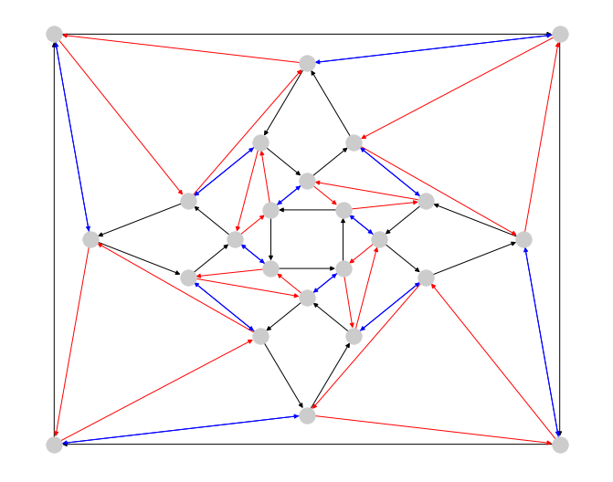

# notebooks

A sample of mathematical topics explored in Jupyter notebooks




## Contents

### 1. group_graphs

Build the Cayley graph of a group presentation

### 2. monte_carlo_areas

Plot and estimate areas of interesting planar regions by random sampling

### 3. multiplication_methods

Explore fast multiplication algorithms

### 4. predicting_loan_default

Very naive hyperparameter selection with LendingClub data


## Tests

1. Install [pytest](https://docs.pytest.org/en/stable/getting-started.html): ```pip install -U pytest```
2. Navigate to the project directory, open a command shell, and run ```pytest```